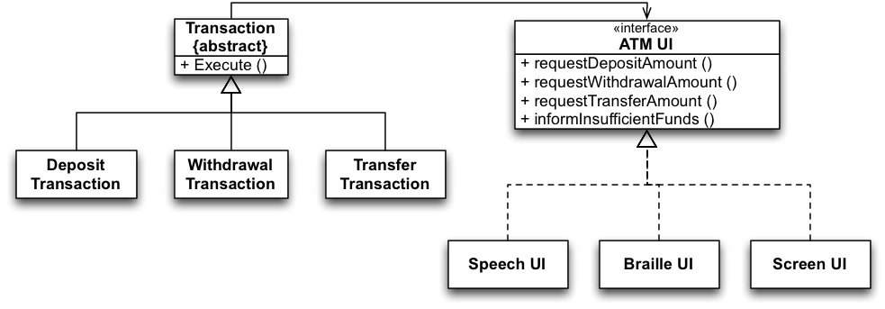

# Interface Segmentation principle

"Many client-specific interfaces are better than one general-purpose interface."

The interface-segregation principle (ISP) states that no client should be forced to depend on methods it does not use.
ISP splits interfaces that are very large into smaller and more specific ones so that clients will only have to know about the methods that are of interest to them. 

Such shrunken interfaces are also called role interfaces. ISP is intended to keep a system decoupled and thus easier to refactor, change, and redeploy. 

ISP is one of the five SOLID principles of object-oriented design, similar to the High Cohesion Principle of GRASP.

This is a typical example before Interface Segmentation Principle.

This is after Interface Segmentation Principle.

