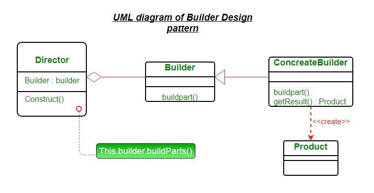

## Builder Pattern
When construction gets a little more complicated.
#### Motivation
* Some objects are simple and can be created in a single constructor call.
* Other objects require a lot of ceremony to create.
* Having an object with 10 constructor arguments is not productive.
* Instead opt for piecewise construction.
* Builder provides an API for constructing an object step-by-step.

## Builder
When piecewise object construction is complicated, provide an API for doing it succinctly.

Builder pattern aims to “Separate the construction of a complex object from its representation so that the same construction process can create different representations.” It is used to construct a complex object step by step and the final step will return the object. The process of constructing an object should be generic so that it can be used to create different representations of the same object.

